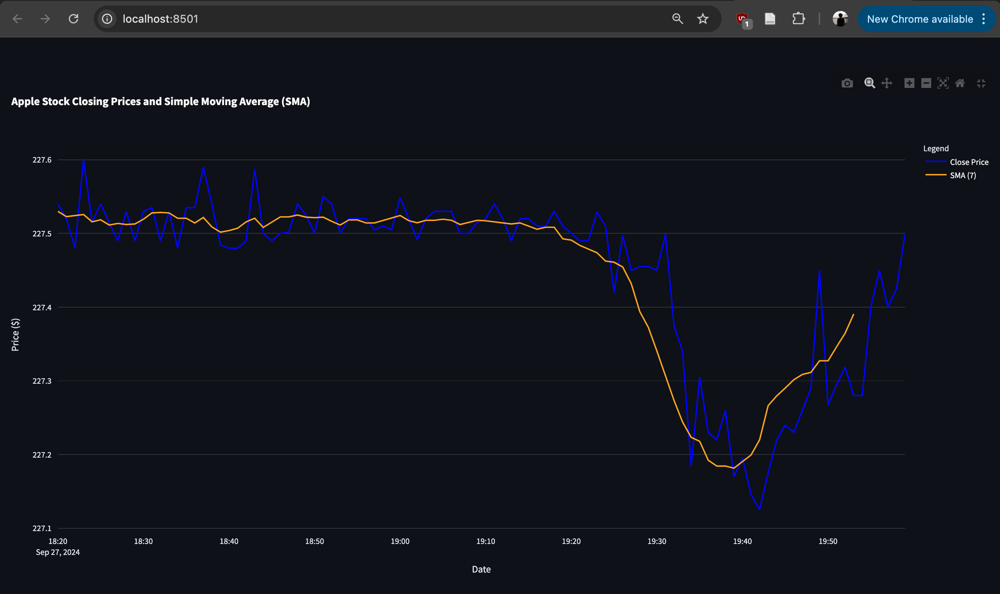

# Airflow - Stock Pipeline

## Overview

The **Airflow Stock Pipeline** is a data pipeline project that automates the extraction, transformation, and loading (ETL) of stock market data into a PostgreSQL database. Built with Apache Airflow for orchestration and Docker for containerization, it efficiently fetches real-time stock data and makes it accessible for analysis through an API.



## Features

- **Automated ETL**: Automates the process of fetching and loading stock data.
- **PostgreSQL Database**: Stores data in a robust PostgreSQL database.
- **API Access**: Makes stock data accessible for analysis and visualization.
- **Containerized with Docker**: Simplifies setup and deployment.

## Getting Started

### Prerequisites

- Docker
- Docker Compose

### Installation

1. Clone the repository:
   ```bash
   git clone https://github.com/AliakbarMehdizadeh/airflow-stockpipeline
   cd airflow-stockpipeline
2. Build and start the services:
   ```bash
   docker-compose up --build -d
3. Create the Dashboard
   ```bash
   streamlit run Dashboard.py

## USAGE 

- Access the Apache Airflow web interface at http://localhost:8080
- Monitor the ETL process and manage your DAGs. Currently set for daily runs at 00:00. 
- Access the Dashboard at http://localhost:8501.
